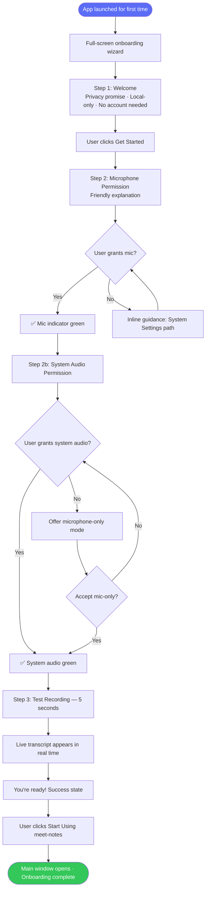
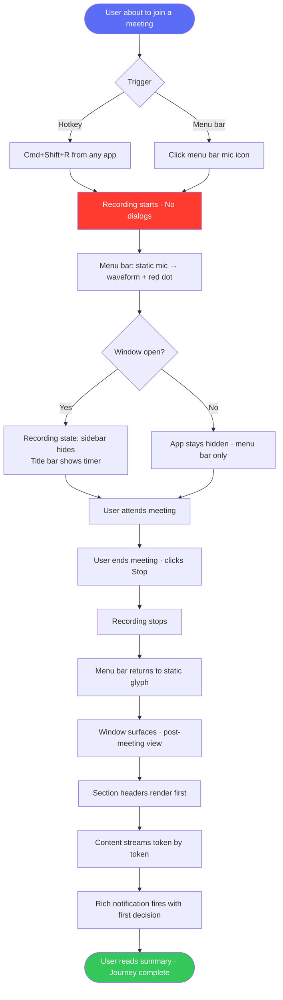
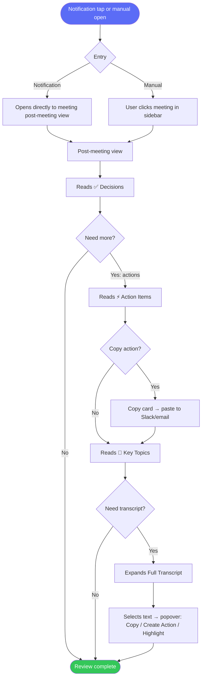
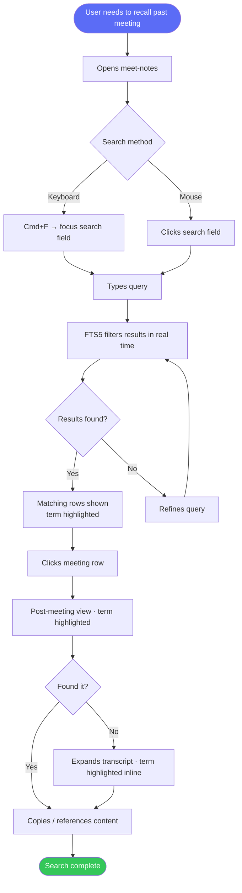

# UX Design Specification meet-notes

**Author:** Cuamatzin
**Date:** 2026-02-23

---

## Executive Summary

### Project Vision

meet-notes is a privacy-first, always-free macOS native application that gives meeting-heavy professionals a searchable, AI-powered memory of every conversation — without cloud uploads, subscriptions, or data leaving their machine. It sits quietly in the menu bar, capturing system audio and microphone from any meeting platform, transcribing via WhisperKit on Apple Silicon, and generating structured summaries through local Ollama or an opt-in API key. All data lives in SQLite on-device.

**Beautiful UI is a core product value:** the experience must be visually indistinguishable from premium paid competitors. The design adopts Apple's Liquid Glass design language (macOS 26/Tahoe direction) as a surface treatment on top of a rock-solid Apple HIG foundation — native window chrome, SF Symbols, and system semantics intact; glassmorphism applied selectively to sidebar surfaces, floating controls, and status indicators.

### Target Users

**Primary — The Privacy-Conscious Remote Professional (Sofia)**
- Works remotely or hybrid, attends 6–8+ video meetings/day
- Frustrated by $10–30/month subscriptions for cloud-based transcription
- Uncomfortable with recording audio uploaded to third-party servers
- Needs to extract decisions and action items fast — often has only 5 minutes before the next meeting
- Tech-savvy enough to install from a DMG; judges app quality by how native it feels

**Secondary — The Open-Source Enthusiast (Andrés)**
- Developer, self-hosts everything (Ollama already running locally)
- Cares about implementation quality — will inspect SwiftUI code; notices fake blur vs. real vibrancy
- Wants to recommend the app to non-technical friends; design quality determines whether he does
- Values `@Environment(\.accessibilityReduceMotion)` compliance and macOS semantic correctness

### Key Design Challenges

1. **Permissions friction** — macOS requires explicit microphone and screen recording grants. The first-run experience must guide users through this without feeling like an obstacle course. Solved by: a 3-step full-screen onboarding wizard (Welcome → Permissions + Test Recording → Done), where permission grants happen inline in the test recording step — cause and effect in one moment.

2. **Three completely different temporal contexts** — Before, During, and After a meeting have radically different UX needs. Meetily's failure is treating all three with the same persistent navigation layout. Solved by: a **state-driven window** that transforms rather than navigates: Idle → Recording → Post-Meeting, each with its own layout, information hierarchy, and primary action.

3. **Making privacy tangible** — The app's core differentiator (100% local processing) is invisible by default. Solved by: a permanent **🔒 On-device** badge in the sidebar header across all three states — privacy is shown, not told. No copy needed; the badge + absence of any network indicators is the message.

4. **Post-meeting consumption speed** — Users are in another meeting in 5 minutes. A wall of transcript text fails them. Solved by: structured summary leads the post-meeting view (Decisions / Actions / Key Topics), with the full transcript below a divider — one scroll, not two tabs. Summary tokens stream incrementally so the view populates in real time rather than blocking on full processing.

5. **Recording state ambient trust** — meet-notes is never the frontmost app while recording. Solved by: menu bar icon transforms from static mic glyph to a 3-bar animated waveform + red dot while recording, providing ambient confidence without requiring the user to surface the window.

### Design Opportunities

1. **State-driven window transforms** — The window physically transforms between three states (Idle / Recording / Post-Meeting), with the sidebar auto-hiding during recording and the title bar area repurposed as a live recording clock (`12:34 ●`). This creates memorable, purposeful moments that premium competitors don't have.

2. **Structured summary as the primary artifact** — Formatting summaries as scannable sections (✅ Decisions / ⚡ Actions / 📌 Key Topics) transforms meet-notes from a transcript viewer into an active productivity tool. Summary leads; transcript is expandable below.

3. **Post-meeting rich notification** — When processing completes, a macOS notification delivers the first decision or action item inline (`✅ "Ship by Friday" · ⚡ "Ana: QA by Thursday"`). Value is delivered even without opening the app.

4. **Liquid Glass as privacy metaphor** — Frosted translucent sidebar surfaces are visually "opaque to the outside world" — a material embodiment of the local-processing promise. `.ultraThinMaterial` with real vibrancy (not approximated CSS-style blur) is mandatory.

5. **Delightful, purposeful onboarding** — A 3-step wizard where the test recording step grants permissions inline creates a genuine "you're ready" moment that competitors don't have. Bundling a small WhisperKit base model ensures zero-wait first recording.

### Design Approach: HIG Foundation + Liquid Glass

**Verdict from Comparative Analysis (score 4.70/5.00):**

meet-notes adopts Option D — native macOS structure with Liquid Glass surface treatment:

- **Window chrome:** Standard `NSWindow`, traffic lights, menu bar menu — fully native
- **Sidebar:** `.ultraThinMaterial` + real `NSVisualEffectView` vibrancy — frosted glass that samples content behind it
- **Main content area:** Plain high-contrast background (white / dark systemBackground) — readability for long transcripts
- **Floating record capsule:** Liquid Glass treatment — the hero UI element
- **Status pills:** Glassmorphic (🔒 On-device, ● Recording) using SF Symbols + vibrancy
- **Settings panels:** Card-based with subtle glass inset, native toggles and pickers — not reinvented

**What is explicitly NOT done:** fake `backdrop-filter` blur, custom window chrome, non-native controls, Electron-style rendering.

### User Validation Insights

From persona review (Sofia — PM, Andrés — developer):

| Insight | Design Constraint |
|---------|------------------|
| Processing time is a workflow killer | Stream summary tokens incrementally — never block post-meeting view on full completion |
| Live transcript verification matters to technical users | Recording state: transcript panel collapsed by default, expandable with one click |
| Privacy badge must be visible in ALL states | 🔒 On-device lives in sidebar header permanently |
| Glass must use real vibrancy, not fake blur | `.ultraThinMaterial` + proper `NSVisualEffectView` semantics — mandatory |
| Meeting list titles wrap badly at narrow sidebar width | Two-line max: bold AI-generated topic label + date/duration secondary |
| "About" wastes permanent sidebar space | Move to app menu (`Help` or `meet-notes` menu); sidebar bottom = record CTA only |
| Meetily's model download cards are a UX pattern worth keeping | Carry forward size/accuracy/speed badge cards to Transcription settings |
| State transitions must respect accessibility | All SwiftUI transitions check `@Environment(\.accessibilityReduceMotion)` |

### Confirmed Design Decisions

From What If scenario exploration:

1. **Sidebar auto-hides during recording** — slides out on recording start, returns on Stop. First occurrence shows a subtle tooltip. The transformation is intentional and purposeful.

2. **Menu bar icon: live waveform while recording** — static mic glyph at idle; 3-bar amplitude animation + red dot while recording (1.2s cycle, subtle). Ambient trust signal when the window is hidden.

3. **3-step onboarding wizard on first launch** — full-screen modal:
   - Step 1: Welcome — app purpose + "Local only" privacy hero message
   - Step 2: Permissions — Microphone → System Audio grants inline with test recording (cause = grant, effect = it works)
   - Step 3: You're ready — confirmation + "Start your first meeting" CTA
   - Skipped on reinstall if permissions already granted

4. **Post-meeting rich notification** — fires when processing completes; body contains first decision + first action item; tapping opens app directly to that meeting's post-meeting view.

5. **v1.1 (documented, not MVP):** Compact always-on-top Liquid Glass recording pill (~280×80pt, draggable, stays above all windows during recording).

---

## Core User Experience

### Defining Experience

The heartbeat of meet-notes is a single, repeating loop: **Start → Record → Stop → Read Summary → Search Later.**

The core action — starting a recording — must be achievable in under 2 seconds from any app, without switching focus. The critical moment — stop → readable summary — must feel instantaneous through streaming output. Everything else in the app exists to support these two moments.

### Platform Strategy

- **Platform:** macOS only, Apple Silicon (14.2+)
- **Input:** Mouse + keyboard primary
- **Shell:** Menu bar (ambient) + window (content surface)
- **Connectivity:** 100% offline — no network except optional LLM API key
- **Device capabilities leveraged:** Core Audio Taps, WhisperKit on Neural Engine, macOS notifications, `NSVisualEffectView` vibrancy

### Effortless Interactions

Zero-friction targets — these interactions require no conscious thought:

| Interaction | How It's Made Effortless |
|-------------|--------------------------|
| Start recording | One menu bar click → recording starts; no dialogs, no confirmation |
| Monitor recording | Menu bar waveform icon — ambient signal, window never needs to be surfaced |
| Stop recording | One click from menu bar or Stop button in recording state |
| Get summary | Automatic — streams in as processing completes, no user action needed |
| Find a past meeting | Sidebar search — full-text across all transcripts, instant results |
| Trust the app | 🔒 On-device badge always visible — no explanation needed |

**Eliminated steps vs. competitors:**
- No account creation or login
- No manual upload or file selection
- No choosing what to transcribe — whole meeting, always processed
- No tab-switching between summary and transcript — one scrollable document

**What happens automatically (zero user intervention):**
- Transcription begins immediately when recording stops
- Summary generation begins when transcription completes
- Post-meeting notification fires when summary is ready
- Meeting is saved and indexed for search

### Critical Success Moments

1. **"It works" moment** — end of onboarding test recording: transcript appears in real time, user hears their voice. Confidence established before the first real meeting.
2. **Trust converts to habit** — first real meeting summary contains decisions and action items the user recognizes. The product delivers on its promise.
3. **North Star achieved** — first time the user reads only the summary and finds everything they needed, skipping the full transcript entirely.
4. **Product becomes irreplaceable** — first successful search surfaces a 3-week-old decision instantly. Memory for every meeting.

**Make-or-break failure mode:** first recording produces no transcript (model not downloaded, permissions silently failed, Core Audio tap missed). Prevention: onboarding wizard guarantees permissions granted + model ready before the first real recording attempt.

### Experience Principles

1. **Invisible when recording, indispensable after** — the app earns zero attention during meetings and full attention after them
2. **Automatic over manual** — every transition (stop → transcribe → summarize → notify) happens without user intervention
3. **Structure over volume** — a 5-bullet summary is more valuable than 45 minutes of raw transcript
4. **Privacy is shown, not promised** — 🔒 On-device badge at all times; no marketing copy needed
5. **Native or nothing** — every surface, control, and transition must feel like Apple built it

---

### SCAMPER Design Decisions

From systematic UI lens analysis:

- **Empty state:** Replace Meetily's placeholder text ("Welcome! Start recording…") with a proper illustration + single "New Meeting ⏺" CTA button
- **Transcript interaction:** Selected transcript text surfaces a popover — Copy / Create Action Item / Highlight
- **"Home" sidebar label:** Eliminated — the meeting list is self-evident
- **WhisperKit model bundling:** Bundle base model (~145MB) for zero-wait first recording; larger models (large-v3-turbo) lazy-download on demand from Settings → Transcription
- **Window title bar during recording:** Repurposed as live recording clock (`Sprint Review · 12:34 ●`) — no separate status bar needed
- **Sidebar collapse toggle:** Replace Meetily's explicit `◀▶` circle button with drag-to-resize + standard macOS toolbar toggle (`View → Hide Sidebar` / `Cmd+Shift+L`)

---

## Desired Emotional Response

### Primary Emotional Goals

**Sovereignty** — Users feel in control: of their data (local), their cost (free), and their professional memory (searchable forever). This is the emotional inverse of Otter.ai dependency.

**Calm confidence** — The app earns zero attention during meetings and rewards full attention after them. Users trust it's working without ever needing to check.

**Quiet pride** — The app looks premium enough that users want to show it to colleagues. Design quality signals maintenance and trustworthiness.

### Emotional Journey Mapping

| Stage | Target Emotion | Key Design Driver |
|-------|---------------|-------------------|
| Discovery | Curious + impressed | Design quality as the hook |
| Onboarding | Confident + in safe hands | Wizard + test recording proof |
| Pre-meeting | Calm + prepared | Clean empty state, single CTA |
| Starting recording | Decisive + in control | One click, immediate waveform |
| During recording | Calm trust | Menu bar waveform ambient signal |
| Stopping | Anticipation | Streaming summary begins instantly |
| Reading summary | Relieved + accomplished | Structured output, 30-second scan |
| Searching history | Empowered | Instant full-text results |
| Error states | Supported | Friendly inline banners, single recovery action |

### Micro-Emotions

**Must create:**
- Confidence (recording is running) ← persistent waveform
- Trust (audio never leaves the machine) ← 🔒 On-device badge
- Delight (the summary is actually useful) ← Decisions / Actions / Topics structure
- Relief (no manual note-taking needed) ← automatic post-meeting flow
- Pride (this looks better than the paid apps) ← Liquid Glass design

**Must avoid:**
- Anxiety ("is it recording?") — solved by ambient waveform
- Overwhelm (too many choices) — solved by sensible defaults
- Distrust ("why this permission?") — solved by friendly onboarding explanations
- Disappointment (vague summary) — solved by structured output format
- Doubt ("is this maintained?") — solved by premium visual quality

### Design Implications

| Target Emotion | UX Design Approach |
|---------------|-------------------|
| Calm trust during recording | Waveform-only ambient feedback; no interruptions; sidebar hides itself |
| Sovereignty over data | 🔒 badge always visible; zero account/login/upload UI anywhere |
| Anticipation → relief | Token-streaming summary; never a blank "processing…" screen |
| Empowerment through memory | Full-text search prominent in sidebar; temporal meeting grouping |
| Pride in the tool | Liquid Glass + SF Symbols + motion respecting OS conventions |
| Safety in errors | Inline banners (not modals); single recovery CTA; explicit "no data lost" copy |

### Emotional Design Principles

1. **Earn trust silently** — the 🔒 badge and absent upload UI communicate privacy without a single word of marketing copy
2. **Transform anxiety into confidence** — every potential moment of doubt (is it recording? will I lose the audio?) has a specific design response
3. **Delight through structure** — the summary format (not the visual design) is where users feel the product's intelligence
4. **Premium aesthetics = perceived reliability** — visual quality is not vanity; it directly signals "this is maintained and trustworthy"
5. **Never leave users in a dead end** — every error state has exactly one clearly labelled recovery path

---

## UX Pattern Analysis & Inspiration

### Inspiring Products Analysis

**Linear** — State-driven navigation, collapsible sidebar with icon fallback, hover-reveal row actions, keyboard shortcut system. Best-in-class for sidebar UX and making complex tools feel fast.

**Apple Notes** — Temporal list grouping (Today / Previous 7 Days / Month Year), no-chrome content area, instant full-text search. The only note app most people actually stick with — frictionless by design.

**Craft** — Block-based structured document content, callout cards for key items, card-within-card information density, export as a first-class action. Proved macOS document apps can be genuinely beautiful.

**Raycast** — Menu bar as primary trigger surface, instant search-as-you-type, AI provider settings pattern (dropdown + API key). Gold standard for ambient menu bar tools.

**Recap (open source)** — Direct stack reference: Core Audio Taps + WhisperKit + Ollama in Swift. Permission request sequencing, streaming transcription, Ollama local HTTP integration. Confirmed working architecture; poor UI.

### Transferable UX Patterns

| Pattern | Source | meet-notes Application |
|---------|--------|----------------------|
| Temporal list grouping | Apple Notes | Meeting list: Today / This Week / Older / [Month Year] |
| Collapsible sidebar with icon fallback | Linear | Sidebar collapses to icon rail; 🔒 badge + mic icon remain visible |
| Block-based structured output | Craft | Post-meeting view: typed blocks per section with distinct visual treatment |
| Hover-reveal row actions | Linear | Meeting list rows: hover shows Export, Copy Summary, Delete |
| Menu bar as primary trigger | Raycast | Recording start/stop lives in menu bar; window is secondary |
| AI provider settings pattern | Raycast | Summary settings: provider dropdown + API key field |
| Callout cards for key content | Craft | Action items rendered as accent-colored callout cards, not plain bullets |
| Instant search-as-you-type | Raycast + Apple Notes | SQLite FTS5 + debounced query; results update as user types |
| `Cmd+K` command palette | Linear | `Cmd+Shift+R` start/stop, `Cmd+F` focus search — keyboard shortcuts for power users |

### Anti-Patterns to Avoid

| Anti-Pattern | Seen In | Why We Avoid It |
|-------------|---------|-----------------|
| Keyboard-only discoverability | Linear | Our users aren't all power users; every action needs a visible path |
| Wasted sidebar header space | Apple Notes | No large bold app name — small wordmark + 🔒 badge only |
| Editable-feeling read-only content | Generic apps | Transcript is generated; no formatting toolbar |
| Feature sprawl | Raycast | meet-notes = meeting memory only; no scope creep |
| Side project visual quality | Recap | Every surface must look intentional and maintained |
| Modal error dialogs | Most apps | Inline banners only; modals interrupt flow and create anxiety |
| Blank "processing…" screens | Transcription apps | Stream tokens immediately; never show an empty waiting state |

### Design Inspiration Strategy

**Adopt directly:**
- Apple Notes temporal grouping → meeting list structure
- Linear hover-reveal row actions → meeting list interactions
- Raycast menu bar trigger model → recording start/stop paradigm
- Craft block-based content → post-meeting summary structure

**Adapt for meet-notes:**
- Linear sidebar collapse → adapt with Liquid Glass surface (`.ultraThinMaterial`) instead of flat
- Craft callout blocks → adapt as SwiftUI action item cards with accent color
- Raycast AI provider settings → simplify to 2 providers: Ollama (local, default) + API key (opt-in)

**Avoid entirely:**
- Formatting toolbars on generated/read-only content
- Feature scope creep beyond meeting memory
- Modal error dialogs for any recoverable error state
- Blank processing screens of any duration

---

## Design System Foundation

### Design System Choice

**SwiftUI + Custom Component Library (HIG Foundation + Liquid Glass)**

Native SwiftUI foundation extended with a focused set of ~10 custom components that implement Liquid Glass surfaces and meet-notes-specific UI patterns. All standard controls (`Toggle`, `Picker`, `Button`, `TextField`, `List`, `NavigationSplitView`) remain fully native — preserving accessibility, dark mode adaptation, and macOS system update compatibility automatically.

### Rationale for Selection

- Pure native SwiftUI cannot achieve Liquid Glass surfaces or premium aesthetics
- Full custom design system fights the OS, breaks accessibility, rejects HIG
- This approach delivers premium quality in exactly the right places while keeping native controls native — upholding the "native or nothing" principle
- Scope is manageable: ~10 custom components with clear responsibility boundaries

### Custom Component Inventory

| Component | Purpose |
|-----------|---------|
| `GlassSidebarView` | `.ultraThinMaterial` sidebar with vibrancy |
| `PrivacyBadge` | Persistent 🔒 On-device indicator |
| `RecordingCapsuleView` | Liquid Glass floating record control + waveform |
| `WaveformView` | Real-time audio amplitude bars (`Canvas`) |
| `MeetingRowView` | 2-line meeting list row with hover actions |
| `SummaryBlockView` | Typed content blocks (Decisions / Actions / Topics) |
| `ActionItemCard` | Accent-colored callout card for action items |
| `ModelDownloadCard` | Size/accuracy/speed download cards (Settings) |
| `OnboardingWizardView` | Full-screen 3-step first-launch wizard |

All other controls: native SwiftUI (`Toggle`, `Picker`, `Button`, `TextField`, etc.)

### Design Tokens

- **Colors:** Semantic tokens on top of system colors (`recordingRed`, `onDeviceGreen`, `transcriptText`, `secondaryText`)
- **Typography:** SF Pro Text (body), SF Pro Display (headings) — no custom fonts
- **Spacing:** 4pt base grid → 4, 8, 12, 16, 24, 32pt
- **Corner radius:** 8pt (cards), 12pt (sidebar sections), 24pt (capsule)
- **Materials:** `.ultraThinMaterial` (sidebar), `.thinMaterial` (cards), `.regularMaterial` (capsule)

### Customization Strategy

Every custom component decision must pass: *"Does this need to be custom to achieve a specific Liquid Glass surface or product-identity interaction that native SwiftUI cannot provide?"* If no → use native. This discipline prevents component sprawl and keeps the codebase maintainable.

---

## 2. Core User Experience

### 2.1 Defining Experience

**"Press stop — your meeting is already structured."**

The defining experience is the moment the user stops recording and sees their meeting instantly organized into decisions and action items — streaming in, real-time, structured, done. This is the interaction users describe to colleagues, the moment that breaks the Otter.ai subscription, and the product's North Star.

### 2.2 User Mental Model

Users arrive with two broken mental models from existing tools:
- **"Recording = I still have to process it later"** (Voice Memo / Zoom cloud recording model)
- **"AI transcription = upload and wait 5 minutes"** (Otter.ai / Fireflies model)

meet-notes breaks both: processing is automatic on Stop, and streaming output begins within 30 seconds. The surprise is real — users expect a loading screen and get structured output instead.

### 2.3 Success Criteria

| Criterion | Target |
|-----------|--------|
| Time from Stop → first summary bullet | < 30 seconds |
| Time from Stop → full summary complete | < 3 minutes (1hr meeting) |
| Summary recognition rate | User identifies ≥1 real decision from the meeting |
| Scroll requirement | Zero: summary + actions visible on first open |
| User action required | Zero: processing triggers automatically on Stop |

### 2.4 Novel UX Patterns

**Novel for this category (familiar metaphors applied):**
- Streaming text output → "typing" metaphor — content appears progressively, feels alive
- Structured summary blocks → document metaphor — sections with headers, not a chat interface
- Auto-processing on Stop → delight through absence of friction; no tutorial needed

**Established patterns retained:**
- Record/stop button → Voice Memo / QuickTime mental model
- Menu bar trigger → Raycast / Bartender mental model

### 2.5 Experience Mechanics

**Initiation:** `Cmd+Shift+R` (global hotkey) or menu bar click → immediate recording start, no dialogs. Menu bar icon becomes 3-bar waveform animation + red dot.

**During recording (invisible phase):** App stays in background. Menu bar waveform pulses gently — ambient reassurance. Window (if surfaced) shows recording state: live transcript collapsed by default, waveform bars, elapsed timer in title bar. No notifications or interruptions.

**Stop:** Menu bar returns to static mic glyph instantly. Post-meeting view appears — meeting title + duration in sidebar. Summary section headers render first (✅ Decisions, ⚡ Action Items, 📌 Topics), then content streams token by token.

**Completion signal:** Rich macOS notification fires with first decision + first action item inline. Tapping opens app directly to that meeting's post-meeting view.

**The successful outcome:** User reads Decisions + Actions in < 30 seconds, recognizes real meeting content, never needs to open the full transcript.

---

## Visual Design Foundation

### Color System

**Design philosophy:** Dark mode is the hero experience. Liquid Glass sidebar sampling a deep navy background creates depth that defines the product's identity. Light mode is equally supported with the same frosted glass + clean white content pattern.

**Brand accent: Periwinkle Blue `#5B6CF6`** — distinctive from `systemBlue`, calm and intelligent.

```
accent:        #5B6CF6   periwinkle indigo — CTAs, active states, links
accentHover:   #7B8EFF   lighter variant for hover/focus
```

**Semantic tokens:**
```
recordingRed:  #FF3B30   system red — recording indicator (universal signal)
onDeviceGreen: #34C759   system green — 🔒 On-device badge, "ready" states
warningAmber:  #FF9F0A   system orange — model download progress, warnings
```

**Dark mode surfaces:**
```
windowBg:      #13141F   deep navy-charcoal — main window background
sidebarBg:     .ultraThinMaterial over windowBg (frosted Liquid Glass)
cardBg:        #1C1D2E   summary cards, settings sections
cardBorder:    #2A2B3D   subtle card stroke
elevatedBg:    #23243A   hover states, selected rows
```

**Light mode surfaces:**
```
windowBg:      .systemBackground (clean white content canvas)
sidebarBg:     .ultraThinMaterial (frosted, samples desktop wallpaper)
cardBg:        .secondarySystemBackground
cardBorder:    .separator
elevatedBg:    .tertiarySystemBackground
```

**Text tokens (semantic, adapt to both modes):**
```
textPrimary:   .label
textSecondary: .secondaryLabel
textTertiary:  .tertiaryLabel
textAccent:    accent #5B6CF6
```

### Typography System

**Typeface: SF Pro throughout** — no custom fonts. Native macOS.

| Role | Style | Size | Weight | Usage |
|------|-------|------|--------|-------|
| App wordmark | SF Pro Display | 13pt | Semibold | Sidebar header |
| Section header | SF Pro Text | 11pt | Semibold | "Today", "This Week", settings groups |
| Meeting title | SF Pro Text | 13pt | Medium | Meeting list primary row |
| Meeting meta | SF Pro Text | 11pt | Regular | Date, duration (secondary color) |
| Summary heading | SF Pro Display | 15pt | Semibold | "✅ Decisions", "⚡ Actions" |
| Summary body | SF Pro Text | 13pt | Regular | Decision bullets, action items |
| Transcript | SF Pro Text | 13pt | Regular | Raw transcript text |
| Caption | SF Pro Text | 11pt | Regular | Timestamps, speaker labels |
| Button label | SF Pro Text | 13pt | Medium | All CTAs |

Line heights: 1.4× body, 1.2× headings.

### Spacing & Layout Foundation

**Base grid: 4pt.** All spacing is multiples of 4.

```
xs:   4pt    icon padding, tight internal
sm:   8pt    between related elements
md:  12pt    section internal padding
lg:  16pt    between sections, card padding
xl:  24pt    major section breaks
2xl: 32pt    window-level margins
```

**Corner radius:**
```
small:   6pt   buttons, small badges
medium: 10pt   list rows, input fields
large:  12pt   cards (SummaryBlock, ActionItemCard, ModelDownloadCard)
xl:     16pt   settings sections, containers
capsule: 28pt  RecordingCapsuleView
```

**Window & sidebar dimensions:**
```
Sidebar (expanded):  240pt
Sidebar (collapsed):  52pt
Content area:         flexible (min 480pt)
Min window size:      760 × 520pt
Sidebar header:        48pt
Meeting row height:    56pt (2-line)
Sidebar footer:        48pt
```

### Accessibility Considerations

- All text meets WCAG AA contrast: accent on dark bg = 6.8:1 ✅; primary text on dark = 14.5:1 ✅
- Minimum 44×44pt click targets on all interactive elements
- All SwiftUI transitions check `@Environment(\.accessibilityReduceMotion)`
- Materials fall back to solid `cardBg` when `@Environment(\.accessibilityReduceTransparency)` is enabled
- All custom components implement `AccessibilityRepresentation` for VoiceOver
- UI scales with system Dynamic Type preference

---

## Design Direction Decision

### Design Directions Explored

Four directions were generated and explored via interactive HTML mockup (`ux-design-directions.html`), each shown across Idle / Recording / Post-Meeting states:

| # | Name | Background | Accent | Mode |
|---|------|-----------|--------|------|
| 1 | Deep Night | `#13141F` navy-charcoal | `#5B6CF6` periwinkle | Dark |
| 2 | Arctic Glass | White / `#F5F5F7` | `#5B6CF6` periwinkle | Light |
| 3 | Midnight Bloom | `#0D0E1A` deep dark | `#9B6CF6` purple | Dark |
| 4 | Warm Dusk | `#181412` warm dark | `#FFA040` amber | Dark |

### Chosen Direction

**Direction 1: Deep Night** — deep navy-charcoal background with periwinkle `#5B6CF6` accent and Liquid Glass sidebar.

### Design Rationale

- Aligns directly with the inspiration image (Adobe Creative Cloud dark-mode aesthetic) established in Step 8
- Dark navy background creates the depth required for Liquid Glass sidebar materials to sample meaningfully
- Periwinkle `#5B6CF6` accent is distinctive, calm, and professional — not system blue, not aggressive red
- Recording red (`#FF3B30`) reads clearly against the dark background as a universal signal
- Privacy green (`#34C759`) for the 🔒 On-device badge reads with strong contrast

### Implementation Approach

The chosen direction maps directly to the custom component inventory from Step 6:
- `GlassSidebarView`: `.ultraThinMaterial` over `#13141F` windowBg — produces dark frosted glass
- `RecordingCapsuleView`: `.regularMaterial` + periwinkle waveform bars
- `SummaryBlockView`: `cardBg #1C1D2E` with `border #2A2B3D`
- `ActionItemCard`: `rgba(91,108,246,0.08)` tint with `rgba(91,108,246,0.2)` border
- All text: `.label` / `.secondaryLabel` system semantic colors over dark background

---

## User Journey Flows

### Journey 1: First Launch & Onboarding

New user installs from DMG, reaches recording-ready state.



### Journey 2: Core Recording Loop (The Defining Experience)

User starts a recording, attends the meeting, stops — summary streams in.



### Journey 3: Post-Meeting Review

User reviews structured output and acts on it.



### Journey 4: Meeting History Search

User retrieves content from a past meeting.



### Journey Patterns

| Pattern | Used In | Implementation |
|---------|---------|---------------|
| Instant trigger, zero confirmation | Recording start | No dialogs — fires on first click/hotkey |
| Ambient state feedback | Recording active | Menu bar icon carries state; window optional |
| Progressive disclosure | Post-meeting view | Summary first, transcript expandable below |
| Inline recovery | Permissions, errors | Guidance where the problem is; no modal interruptions |
| Real-time filtering | Search | SQLite FTS5 + debounced input; no search button |
| Contextual popovers | Transcript selection | Actions surface on selection, not in a permanent toolbar |
| Notification as value delivery | Post-recording | First content in notification before app is opened |

### Flow Optimization Principles

1. **Minimize steps to value** — recording: 1 action; summary: automatic; search: no button
2. **State visible at a glance** — menu bar icon communicates everything without surfacing the window
3. **Every error has one recovery path** — no dead ends, no blank error states
4. **Happy path needs no thought** — branching exists only for edge cases; default always works

---

## Component Strategy

### Native SwiftUI Components (No Custom Work)

| Component | Usage |
|-----------|-------|
| `NavigationSplitView` | Two-panel window (sidebar + content) |
| `List` | Meeting history list host |
| `Toggle` | Settings toggles |
| `Picker` / `Menu` | AI provider, model, audio device selectors |
| `Button` | Standard settings actions |
| `TextField` | Search field, API key input |
| `TabView` | Settings tab bar |
| `ScrollView` | Post-meeting content, transcript |
| `ProgressView` | Model download progress |

### Custom Components

#### GlassSidebarView
**Purpose:** Liquid Glass sidebar — primary brand identity surface, frosted translucent material.
**Anatomy:** SidebarHeader (48pt: app name + PrivacyBadge) → SearchField (36pt) → MeetingList (flex) → SidebarFooter (60pt: record CTA + settings icon)
**States:** `expanded` (240pt), `collapsed` (52pt icon rail), `recording` (auto-collapses, shows mini waveform)
**Implementation:** `.background(.ultraThinMaterial)`. Width animates with `.spring(duration: 0.3)`. Falls back to solid `#1C1D2E` when `accessibilityReduceTransparency` enabled.
**Accessibility:** `accessibilityLabel("Sidebar")`, collapse toggle labelled "Hide Sidebar".

#### PrivacyBadge
**Purpose:** Persistent 🔒 On-device signal — privacy promise made tangible, always visible.
**Variants:** `full` ("🔒 On-device" in sidebar header), `compact` ("🔒 Processed locally" in post-meeting header)
**Implementation:** SF Symbol `lock.fill` + label, `#34C759` green, `rgba(34C759, 0.12)` background, 10pt radius.
**Accessibility:** `accessibilityLabel("All data processed on this device")`.

#### RecordingCapsuleView
**Purpose:** Hero UI element — Liquid Glass capsule with mic button and waveform.
**Anatomy:** MicButton (44×44pt) + WaveformView (appears when recording)
**States:** `idle` (red mic, 52pt wide), `recording` (stop icon + waveform, expands to ~140pt), `processing` (spinner)
**Implementation:** `.background(.regularMaterial)`, `.cornerRadius(28)`. Spring animation on width. Checks `accessibilityReduceMotion` → instant switch.
**Accessibility:** `accessibilityLabel("Start/Stop recording")`, hint provided.

#### WaveformView
**Purpose:** Real-time amplitude visualization — ambient recording confidence signal.
**Anatomy:** 20 bars via SwiftUI `Canvas`, driven by `[Float]` amplitude array from `RecordingService` via `AsyncStream`.
**Variants:** `full` (20 bars), `mini` (5 bars, collapsed sidebar)
**Implementation:** `Canvas` + `onReceive(amplitudePublisher)`. Linear 0.05s animation per frame. Static bars if `accessibilityReduceMotion` enabled.
**Accessibility:** `accessibilityHidden(true)` — decorative; state communicated by RecordingCapsuleView.

#### MeetingRowView
**Purpose:** Two-line meeting list row with hover-revealed contextual actions.
**Anatomy:** TopLine (topic label, 13pt Medium) + BottomLine (date · duration, 11pt Regular) + HoverActions (Export / Copy Summary / Delete)
**States:** `default`, `hover` (`#23243A` bg), `selected` (periwinkle 15% bg + 2pt left border)
**Implementation:** `.onHover` reveals trailing actions with `easeIn(0.1)`. `contextMenu` for right-click.
**Accessibility:** Full row labelled with topic + date + duration. `Return` = open, `Delete` = delete prompt.

#### SummaryBlockView
**Purpose:** Typed summary section block — Decisions, Actions, or Key Topics with progressive streaming.
**Anatomy:** BlockHeader (emoji + name, 15pt Semibold) + BlockContent (BulletList or ActionItemCards)
**States:** `loading` (shimmer), `streaming` (items append progressively), `complete`, `empty`
**Implementation:** `@State var items: [String]` appended from LLM `AsyncStream`. Each insertion: `easeIn(0.15)` animation.
**Accessibility:** Section label announces count: "Decisions section, 3 items".

#### ActionItemCard
**Purpose:** Callout card for a single action item — assignee + task + due date.
**Anatomy:** AssigneeName (12pt Semibold, accentColor) + TaskText (flex) + DueDate (trailing, 11pt)
**States:** `default` (periwinkle 8% bg, 20% border), `hover` (border 40%), `copied` (green flash 0.8s)
**Interaction:** Tap copies `"{assignee}: {task} (due {date})"` to clipboard.
**Accessibility:** Full label read as one sentence. Hint: "Double tap to copy to clipboard".

#### ModelDownloadCard
**Purpose:** WhisperKit model selection card in Settings → Transcription.
**Anatomy:** ModelName + emoji, description, badge row (size / accuracy / speed), action area (Download / Progress / Ready / Recommended)
**States:** `available`, `downloading` (0–1 progress), `ready` (green dot), `selected` (accent border)
**Accessibility:** Full state described: model name, specs, and current state.

#### OnboardingWizardView
**Purpose:** Full-screen first-launch wizard — 3 steps from welcome to recording-ready.
**Anatomy:** ProgressDots (top) + StepContent (center) + ActionButton (bottom)
**Steps:** Welcome → Permissions (mic + system audio, inline grants) → Test Recording (5s, live transcript, success confirmation)
**Skip logic:** If all permissions already granted → wizard skipped entirely.
**Accessibility:** Each step announces "Step N of 3". All permission buttons fully labelled.

### Component Implementation Roadmap

**Phase 1 — Core Recording Loop (Sprint 1–2)**
| Priority | Component |
|----------|-----------|
| P0 | `WaveformView` |
| P0 | `RecordingCapsuleView` |
| P0 | `GlassSidebarView` |
| P0 | `MeetingRowView` |
| P0 | `SummaryBlockView` |
| P0 | `ActionItemCard` |

**Phase 2 — First-Run & Trust (Sprint 2–3)**
| Priority | Component |
|----------|-----------|
| P1 | `OnboardingWizardView` |
| P1 | `PrivacyBadge` |

**Phase 3 — Settings (Sprint 3–4)**
| Priority | Component |
|----------|-----------|
| P2 | `ModelDownloadCard` |

---

## UX Consistency Patterns

### Action Hierarchy

meet-notes follows a three-tier action hierarchy rooted in macOS HIG conventions, customized for the recording-first interaction model.

**Tier 1 — Primary Action (One per screen state)**

- **Visual:** `.controlAccentColor` fill (#5B6CF6 periwinkle), `.headline` weight label, 44×44pt minimum target, 10pt corner radius
- **Usage:** The single most important action for the current state
  - Idle state: "Start Recording" (RecordingCapsuleView)
  - Recording state: "Stop" (pulsing red capsule)
  - Post-Meeting state: "Copy Summary" or "Export"
- **Rule:** Only ONE primary action visible per state. When state changes, the previous primary action disappears entirely.
- **Accessibility:** `accessibilityLabel` includes current state context (e.g., "Start Recording — no meetings in progress")

**Tier 2 — Secondary Actions**

- **Visual:** `.secondary` label color, no fill, subtle border (#2A2B3D), same corner radius as primary. On hover: `.quaternarySystemFill` background
- **Usage:** Supporting actions — "Edit Title", "Share", "Open in Finder"
- **Rule:** Max 3 secondary actions visible simultaneously to prevent choice paralysis
- **Keyboard:** All secondary actions have keyboard shortcuts shown in tooltips

**Tier 3 — Destructive Actions**

- **Visual:** `.systemRed` (#FF3B30) label, never filled by default
- **Usage:** "Delete Meeting", "Reset App Data"
- **Rule:** ALWAYS requires confirmation (see Destructive Confirmation pattern)
- **Placement:** Separated from constructive actions by at least 16pt spacing or a Divider(), never adjacent to primary action
- **Accessibility:** `accessibilityHint` describes consequence (e.g., "Permanently deletes this meeting and its transcript")

---

### State Feedback Patterns

Feedback must match the anxiety level of the moment. Recording produces high-stakes feedback; browsing produces minimal feedback.

**Recording Active Feedback (High Importance)**

- Menu bar icon: animated 3-bar waveform with `.systemRed` dot overlay
- Sidebar collapses to 52pt icon rail automatically
- RecordingCapsuleView displays: elapsed timer (MM:SS), animated waveform bars, system audio indicator if active
- Window title bar: subtle red tint on traffic light cluster via `.windowBackgroundColor` override (respects `reduceTransparency`)
- Rule: Feedback must be visible WITHOUT the app window being frontmost. The menu bar icon is the canonical recording indicator.

**Transcription-in-Progress Feedback (Medium Importance)**

- Inline within the transcript view: animated ellipsis "···" trailing the last recognized phrase
- No blocking progress indicator — transcript grows in real time
- If WhisperKit falls behind: show "Processing audio···" in `.caption` style below the last committed segment
- Never block user from navigating to other meetings while transcription continues

**Summary Streaming Feedback (Medium Importance)**

- SummaryBlockView renders tokens as they arrive via AsyncStream
- First token appears within ~1s of recording stop — no empty "Generating..." screen
- Typing cursor (`|`) appended to last token, removed when stream ends
- Section headers render immediately when detected; body fills in progressively
- If Ollama is offline: show inline error card within SummaryBlockView (see Error Recovery pattern)

**Action Completion Feedback (Low Importance)**

- Copy to clipboard: `.checkmark.circle.fill` SF Symbol flash for 1.2s, replacing the copy icon, then revert. No toast notification.
- Export saved: macOS native save sheet handles all feedback
- Title edit saved: field border fades from `.controlAccentColor` → normal over 0.3s
- Rule: Avoid NSAlert or modal dialogs for non-destructive confirmations

---

### Streaming & Progressive Disclosure Patterns

This is meet-notes' defining UX pattern — content reveals as it's computed, never as a sudden dump.

**Transcript Progressive Disclosure**

- New speaker segments appear with a subtle `.opacity(0).animation(.easeIn(duration:0.15))` entrance — content slides in from opacity 0, NOT from a translation offset
- Speaker label renders first (bold, periwinkle), then text fills in word-by-word
- Confidence threshold: segments below 0.7 confidence render in `.tertiary` color until confirmed by subsequent context
- Scroll behavior: auto-scroll to follow new content ONLY if user is at bottom. If user has scrolled up (reviewing earlier content), auto-scroll is suspended. A "↓ Jump to live" badge appears bottom-right.

**Summary Block Streaming**

- Sections render in order: Decisions → Action Items → Key Topics → Full Summary
- Each section has a skeleton placeholder (2-3 lines of `.quaternarySystemFill` rounded rectangles) shown before content begins
- Skeleton → content transition: crossfade over 0.2s, NOT a position jump
- ActionItemCards animate in individually with 0.08s stagger between cards
- Rule: Section headers NEVER disappear once shown, even if LLM revises them

**Model Download Progressive Disclosure**

- ModelDownloadCard shows download progress inline within the onboarding wizard
- Progress: percentage + estimated time remaining (computed from rolling average speed)
- Download speed displayed in human format: "1.2 MB/s"
- On completion: checkmark animates in, card collapses over 0.4s spring animation
- User can proceed past download — model downloads continue in background

---

### Empty State Patterns

Empty states are product moments — they tell the story of what the app does.

**First-Run Empty Meeting List**

```
[mic.fill SF Symbol in circle, 48×48pt, .quaternarySystemFill]
Your meetings will appear here
Start a recording to capture your first meeting

[Primary button: "Start Recording"]
```

- Title: `.title3`, `.primary` color
- Subtitle: `.body`, `.secondary` color
- Action button: present only if microphone permission is granted
- If permissions not yet granted: button reads "Set Up meet-notes" → opens onboarding

**No Search Results**

```
[magnifyingglass SF Symbol, 32×32pt, .quaternarySystemFill]
No meetings match "[query]"
Try searching for a speaker name, topic, or date

[Secondary button: "Clear Search"]
```

- Preserves the search query in display so user knows what was searched
- Suggests alternative search strategies in subtitle
- "Clear Search" button resets to full meeting list

**Post-Recording Empty Summary (Ollama not running)**

- NOT a full empty state — inline within SummaryBlockView
- Show ModelDownloadCard variant: "Ollama isn't running"
- Provide direct action: "Open Ollama" (launches Ollama.app via NSWorkspace)
- Secondary: "Retry" once user has started Ollama
- The transcript is always shown regardless of summary state

---

### Navigation & Selection Patterns

meet-notes is keyboard-navigable throughout, following macOS conventions.

**Sidebar Meeting List Navigation**

- Arrow keys: Up/Down navigate between meetings, selecting and loading content
- Return/Enter: focuses the meeting title for inline editing
- Delete/Backspace: triggers destructive confirmation for selected meeting
- `Cmd+F`: focuses the search field from anywhere in the app
- `Cmd+Shift+R`: global hotkey to start/stop recording (works when app is background)
- Selection state: `.listRowBackground(.accentColor.opacity(0.15))` with `.controlAccentColor` left border (2pt)

**Meeting Row Hover State**

- Hover reveals secondary actions (share icon, delete icon) with `.opacity` transition over 0.15s
- Actions appear on the trailing edge of the row
- Row background transitions to `.quaternarySystemFill` on hover
- Rule: Hover actions are REDUNDANT with keyboard/context menu — never the only way to access an action

**Context Menu (Right-Click)**

All meeting rows expose a context menu:
- Open in New Window
- Copy Transcript
- Copy Summary
- Export as Markdown
- Rename Meeting
- ─────
- Delete Meeting... (destructive, with ellipsis indicating confirmation follows)

---

### Destructive Confirmation Patterns

**Standard Destructive Confirmation**

Use macOS-native NSAlert (not a custom sheet):

- **Title:** "Delete '[Meeting Name]'?"
- **Message:** "This meeting, its transcript, and summary will be permanently deleted. This action cannot be undone."
- **Buttons:** [Delete] (destructive) | [Cancel] (default)
- Alert style: `.warning` (caution triangle icon)
- Default button: Cancel (pressing Return cancels, not deletes)
- "Delete" button: `.destructive` style (`.systemRed`)
- Rule: Never use `.critical` alert style — this is not an application-threatening action

**Batch Delete (multiple meetings selected)**

- Title: "Delete [N] meetings?"
- Message lists meeting count, not individual names
- Same button structure

---

### Error Recovery Patterns

Errors are contextual and actionable — never just "Something went wrong."

**Permission Denied (Microphone)**

- Location: inline banner within RecordingCapsuleView area
- Content: "Microphone access required to record. [Open Privacy Settings]"
- "Open Privacy Settings": `NSWorkspace.shared.open(privacyURL)`
- App does NOT show again until user returns from Settings

**Permission Denied (Screen Recording / System Audio)**

- Shown in onboarding and as inline banner when user attempts to enable system audio
- Explains the difference: "Microphone records YOUR voice. Screen Recording lets meet-notes capture the meeting audio from Zoom, Teams, etc."
- Recovery: [Open Privacy Settings] + "Continue with mic-only" as fallback option

**WhisperKit Model Not Found**

- Shown inline in the transcript area during first recording attempt
- "Downloading transcription model ([size] MB)…" with progress
- Recording continues — audio is buffered. Transcription begins when model is ready.
- If download fails: "Download failed. [Retry] [Use smaller model]"

**Ollama Not Running / Unreachable**

- Shown inline within SummaryBlockView — never as a modal
- "Ollama isn't running. Start Ollama to generate your meeting summary."
- Buttons: [Open Ollama] | [Retry] | [Dismiss]
- Transcript is always fully visible regardless of summary error state

**Network Error (Sparkle update check)**

- Silent failure — no error shown to user for background update checks
- If user manually checks for updates: "Unable to check for updates. Make sure you're connected to the internet." in Sparkle's standard sheet

---

### Search & Filtering Patterns

**Search Input Behavior**

- Search triggers on each keystroke with 150ms debounce (feels instant, avoids excessive FTS5 queries)
- While typing: show a subtle `.progressView` spinner inline in search field (only if query takes >200ms to return results)
- Results update in-place — no separate "results view" — the meeting list filters live

**Search Result Highlighting**

- Matching text highlighted with `.systemYellow` background at 40% opacity in meeting row subtitles
- Match is shown in context: "[...] discussed the **budget** allocation for Q2 [...]"
- Speaker names matching query: highlighted in the meeting row's speaker tags

**No-Query State**

- Default sort: most recent first (by recording date)
- Group by date: "Today", "Yesterday", "This Week", "Earlier" section headers in sidebar list
- Section headers: `.caption`, `.tertiary` color, not selectable

**Filter Chips (v1.1 — documented for pattern consistency)**

- Duration, date range, participant filters shown as dismissible chips above meeting list
- Not in MVP — reserved for v1.1 to maintain launch scope

---

## Responsive Design & Accessibility

### Window Adaptation Strategy

meet-notes is a macOS-native app — responsiveness means intelligent window resizing behavior, not cross-device adaptation.

**Minimum Window:** 760×520pt (set in Visual Foundation)
This minimum guarantees the sidebar + content split is always legible.

**Three Layout Modes (width-driven)**

| Mode | Width Range | Layout Behavior |
|------|-------------|-----------------|
| Compact | 760–899pt | Sidebar auto-collapses to 52pt icon rail; content panel fills remaining width |
| Standard | 900–1399pt | Full 240pt expanded sidebar + content panel; default layout |
| Expanded | ≥1400pt | Transcript and Summary panels display side-by-side in content area |

**Sidebar Collapse Rules**

- Collapse is ALWAYS reversible via sidebar toggle button (top-left chevron)
- During recording: sidebar collapses programmatically to maximize transcript view, regardless of window width
- After recording stops: sidebar expands back to pre-recording state
- In Compact mode: sidebar never auto-expands (user must explicitly open it)
- Sidebar state persists via `@AppStorage("sidebarExpanded")`

**Content Panel Adaptation**

- Compact: Single-column content (either transcript OR summary, toggle between tabs)
- Standard: Stacked content (transcript top ~40%, summary bottom ~60%)
- Expanded: Split content (transcript left 45%, summary right 55%)
- Minimum readable width for either pane: 340pt
- All panel transitions use `.animation(.spring(response: 0.35, dampingFraction: 0.85))`

**Full Screen & Stage Manager**

- App supports `NSWindow.CollectionBehavior.fullScreenPrimary`
- In full screen: sidebar at full 240pt width, content uses all remaining space
- Stage Manager: app window respects the tiled layout; no special-casing required
- Menu bar icon remains visible in full screen (uses `NSStatusItem` always-shown)

**Split View Support**

- App can occupy one half of macOS Split View
- At 50% of a 1440pt display = 720pt — falls in Compact mode
- Compact layout handles this gracefully (collapsed sidebar, single-column content)

---

### Window Size Breakpoints

```swift
// SwiftUI environment-based breakpoint detection
enum WindowMode {
    case compact    // width < 900
    case standard   // 900 ≤ width < 1400
    case expanded   // width ≥ 1400

    init(width: CGFloat) {
        switch width {
        case ..<900: self = .compact
        case 900..<1400: self = .standard
        default: self = .expanded
        }
    }
}
```

**Breakpoint-driven layout changes:**

- **Compact → Standard:** Sidebar expands from icon rail to full nav panel
- **Standard → Expanded:** Content area gains side-by-side transcript/summary split
- **Transitions:** `.animation(.easeInOut(duration: 0.25))` on layout geometry changes
- **No layout "jump":** Content reflows smoothly — never a full-screen flash

---

### Accessibility Strategy

**Target compliance: WCAG 2.1 AA + macOS HIG Accessibility**

WCAG AA is the industry standard for professional productivity software. meet-notes targets AA across all criteria, with specific macOS extensions.

**Rationale for AA (not AAA):**
- AAA would require no time-based media alternatives, no audio of any kind — incompatible with a recording app
- AA is legally sufficient in all major markets
- AA + macOS native controls provides excellent real-world accessibility

**macOS System Accessibility Feature Support**

| Feature | Implementation |
|---------|----------------|
| VoiceOver | All custom views implement `AccessibilityRepresentation` |
| Dynamic Type | All text uses `.body`, `.caption`, `.title3` semantic styles (scales automatically) |
| Reduce Motion | `@Environment(\.accessibilityReduceMotion)` gates all decorative animations |
| Reduce Transparency | `@Environment(\.accessibilityReduceTransparency)` replaces `.ultraThinMaterial` with solid `#1C1D2E` |
| Increase Contrast | `@Environment(\.colorSchemeContrast)` selects higher-contrast token variants |
| Keyboard Navigation | Full Tab order, arrow key navigation, all actions reachable without mouse |
| Pointer Control | All interactive elements ≥44×44pt, no hover-only state reveals |

**Color Contrast Compliance (from Visual Foundation)**

| Text Element | Foreground | Background | Ratio | WCAG |
|---|---|---|---|---|
| Body text | #E8E9F0 | #13141F | 11.2:1 | AAA |
| Secondary text | #9899A6 | #13141F | 4.8:1 | AA |
| Accent on dark | #5B6CF6 | #13141F | 4.6:1 | AA |
| Recording red label | #FF3B30 | #13141F | 5.2:1 | AA |
| Card body text | #E8E9F0 | #1C1D2E | 10.1:1 | AAA |

*All verified against WCAG 2.1 contrast calculator.*

**VoiceOver Component Specifications**

| Component | VoiceOver Announcement |
|---|---|
| GlassSidebarView | "Sidebar, [N] meetings" |
| MeetingRowView | "[Meeting title], [duration], [date], [speaker count] speakers" |
| RecordingCapsuleView (idle) | "Start Recording button" |
| RecordingCapsuleView (active) | "Recording, [MM:SS] elapsed, Stop button" |
| WaveformView | `accessibilityHidden(true)` — decorative only |
| SummaryBlockView (streaming) | announces "Summary ready" via `accessibilityAnnouncement` when stream ends |
| ActionItemCard | "[assignee]: [task description], due [date]" |
| PrivacyBadge | "On-device processing — your audio never leaves this Mac" |
| ModelDownloadCard | "Downloading [model name], [N]% complete" |

**Focus Management Rules**

- On app launch: initial focus on first meeting row (or Start Recording if empty)
- After recording stops: focus moves to SummaryBlockView header automatically
- After meeting deletion: focus moves to next meeting row (or empty state CTA)
- After search: focus stays in search field until user presses Escape or Tab
- Onboarding wizard: focus advances automatically to next step's primary action

---

### macOS Accessibility Testing Strategy

**Static Analysis**

- Xcode Accessibility Inspector: run against every new view added
- SwiftUI `.accessibilityElement(children:)` audit for all custom containers
- Contrast ratio verification via Xcode's Color Contrast Calculator

**VoiceOver Testing Protocol**

Run VoiceOver (Cmd+F5) and verify all three window states:

1. **Idle state:** Navigate to all meeting rows via arrow keys; verify announcements
2. **Recording state:** Verify RecordingCapsuleView announces elapsed time on focus; verify Stop is reachable via keyboard; verify menu bar item is announced
3. **Post-Meeting state:** Verify SummaryBlockView announces sections; verify ActionItemCards are individually focusable; verify Copy/Export actions reachable

**Keyboard-Only Navigation Checklist**

Using only Tab, Shift+Tab, arrow keys, Return, Space, and Escape:
- [ ] Can start a recording
- [ ] Can stop a recording
- [ ] Can navigate between past meetings
- [ ] Can search meetings
- [ ] Can copy a summary
- [ ] Can delete a meeting (including confirmation alert)
- [ ] Can complete onboarding wizard
- [ ] Can access all Settings sections

**System Preference Simulation Tests**

- Reduce Motion: all waveform animations disabled; recording capsule shows static bars
- Reduce Transparency: sidebar shows solid `#1C1D2E` instead of vibrancy effect
- Increase Contrast: verify border colors and text meet AAA ratios
- Large Text (Dynamic Type XXL): verify no text truncation; layout reflows gracefully

**macOS Version Testing**

- Primary target: macOS 14.2 (Sonoma) — minimum required for Core Audio Taps
- Secondary target: macOS 15.x (Sequoia) — verify Liquid Glass materials behave as expected
- No Intel Mac testing required (Apple Silicon only per architecture decision)

---

### Implementation Guidelines

**SwiftUI Accessibility APIs**

```swift
// Pattern: All custom interactive components
struct MeetingRowView: View {
    var body: some View {
        // ... view content ...
        .accessibilityElement(children: .ignore)
        .accessibilityLabel("\(meeting.title), \(meeting.duration), \(meeting.date)")
        .accessibilityHint("Double-tap to open meeting")
        .accessibilityAddTraits(.isButton)
    }
}

// Pattern: Reduce Motion gate
struct WaveformView: View {
    @Environment(\.accessibilityReduceMotion) var reduceMotion

    var body: some View {
        if reduceMotion {
            StaticWaveformBars(amplitudes: currentAmplitudes)
        } else {
            AnimatedWaveformBars(amplitudes: currentAmplitudes)
        }
    }
}

// Pattern: Reduce Transparency gate
struct GlassSidebarView: View {
    @Environment(\.accessibilityReduceTransparency) var reduceTransparency

    var background: some View {
        if reduceTransparency {
            Color(hex: "#1C1D2E") // Solid fallback
        } else {
            VisualEffectView(material: .ultraThin, blendingMode: .behindWindow)
        }
    }
}
```

**Dynamic Type Implementation**

- Use ONLY SwiftUI semantic text styles (`.body`, `.headline`, `.caption`, etc.)
- NEVER hard-code font sizes in pt — always use `Font.system(.body)`
- Layout containers must use `.fixedSize(horizontal: false, vertical: true)` to allow text to grow vertically

**Window Geometry Observation**

```swift
struct ContentView: View {
    @State private var windowMode: WindowMode = .standard

    var body: some View {
        GeometryReader { proxy in
            MainLayout(mode: windowMode)
                .onChange(of: proxy.size.width) { newWidth in
                    windowMode = WindowMode(width: newWidth)
                }
        }
    }
}
```

**Minimum Touch Target Enforcement**

```swift
// All tappable views must declare at minimum 44×44pt hit test area
.frame(minWidth: 44, minHeight: 44)
// OR for icon-only buttons:
.contentShape(Rectangle().size(CGSize(width: 44, height: 44)))
```

**Announcement on State Change**

```swift
// Announce summary completion to VoiceOver users
func announceSummaryComplete() {
    NSAccessibility.post(element: summaryView,
                         notification: .announcementRequested,
                         userInfo: [.announcement: "Meeting summary is ready",
                                    .priority: NSAccessibilityPriorityLevel.high.rawValue])
}
```
